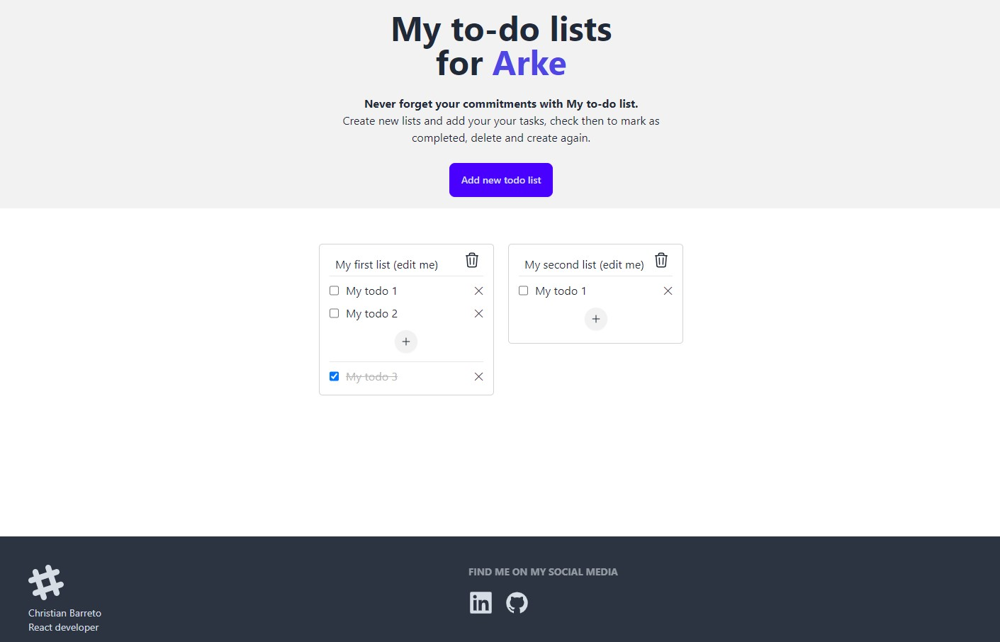

# My to-do lists (for Arke)

This is a functional implementation of a to-do list where you can keep notes of your errends. 

**This project is part of the selection process of ARKE.**

## 1. How it works

If you are accessing at the first time, you will see two pre defiened to-do lists which you can edit the title, the to-dos, you can check them as completed, delete it or create new to-dos. You can also create new or delete lists.

**Beyond the requirements** I decided not only to follow the requirement but go beyond: This application does not only allow the user create to-do tasks in a list, but they can create multiple lists to be at your disposal.

## 2. Archtecture & Design patterns

### 2.1 Directory structure
The directories on this project were structured based on atomic design pattern, this concept is the most aling with the React atomicity characteristic, for creating reuseble components.

### 2.2 React application
Once this application has the intention to be a single page application with a simple functionality I decided to implement React with Vite that allows the application run very fast.

### 2.3 TypeScript
This application uses TypeScript for safety and mantainability. The main types for todo lists are located on `/src/types`.

### 2.4 Context API
To show more complex capabilities I decided to implement the feature logic and data structure handling in a React Context and dispatch. The data was made available where this context component is parent and the dispatch methods is capable to change the data structure in order to add, edit and delete to-do lists and add, edit and delete to-dos.

### 2.5 Styling
The style applyed for this project was module css files for each component following the atomic design pattern.

I also implemented the TailwindCSS and DaisyUI for Hero and Footer components.

This combination is often used in professionals web systems that combines CSS frameworks with a design system customizations and specific CSS files for more in deep customization.

### 2.6 Routes & Template
This project is a single page application, so I decided to not use a router, but the a template was structured in way that if a router is used, it can be easealy changed to keep the fixed components (header and footer) and change only the page content.

### 2.7 Local Storage
This application saves your to-do lists on local storage, it means that all your changes will be saved on your browser and even if you reload the page or close it, your lists will be there.

### 2.8 Animations & Transitions
Was included a simple animation when a mouse hovers a list. This animation was included on a module CSS file.

### 2.9 ESLint
This codebase is configured with ESLint for code standardization and styling.

## 3. Who am I
> **Christian Barreto**
> 5 years experienced front end developer.
> Click here for [My LinkedIn](https://www.linkedin.com/in/christiannabasbarreto/).